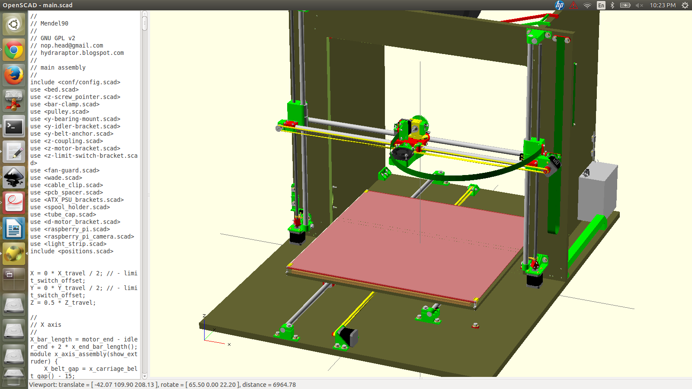
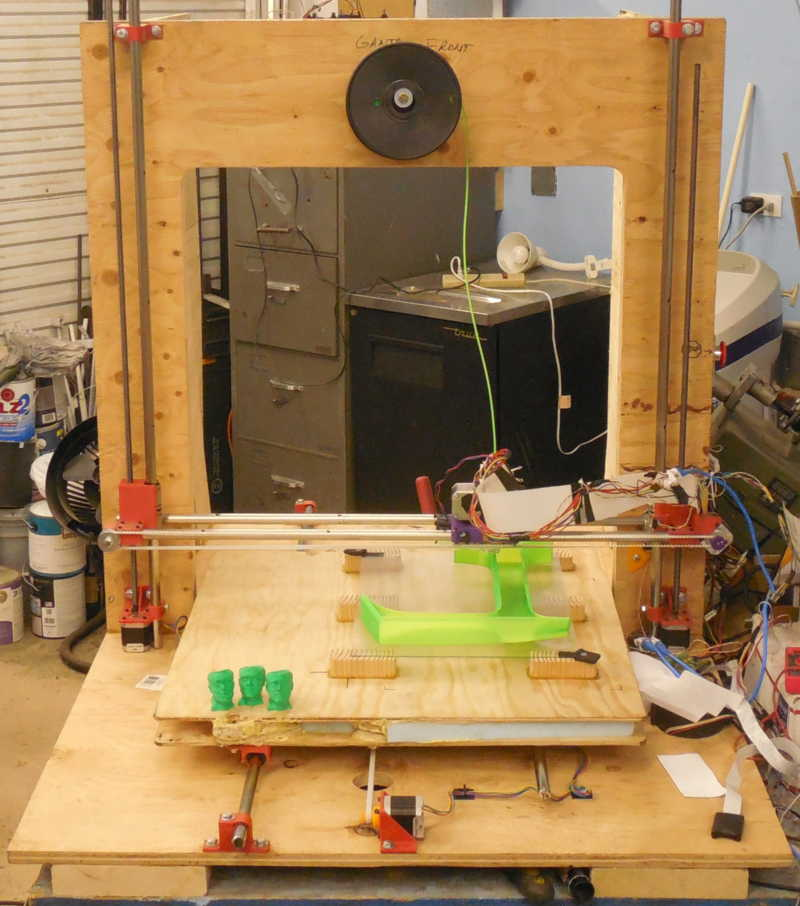

# Alaska90 3D printer design
This is the Alaska90, an enormous 3D printer.  It's not a tabletop machine--it's the size of a table!

Main features:
* 600mm x 500mm x 600mm build volume (24 inch x 20 inch x 24 inch), to construct models as big as a few feet on each side.
* Frame is built from 3/4 inch plywood, and parts are secured using large 1/4 inch hex head bolts (instead of M4 screws).
* Uses heavy 16mm steel rods, so it's rigid enough to mill wood with a small dremel tool.
* Support rods are moved inward, to gauss points, to better support the 24 inch x 24 inch bed.






This is an open source hardware design that started from Chris Palmer/nophead's amazing parametric CAD printer generator system Mendel90, with a number of changes by Dr. Orion Lawlor to accomodate the much larger machine.  This version is definitely "beta" quality, with several crude hacks in the OpenSCAD to make the STL parts work at the larger size.  Also, I laid out the frame holes by hand because I couldn't find a router big enough to cut the full 4ft x 3ft sheet, so the DXFs are likely to be somewhat inaccurate.


# Making giant 3D prints

There are a number of challenges in scaling up a 3D printer this big:

* Time per print.  At a fixed layer height, if you double the size of the object, the number of layers doubles, the time per perimeter doubles, and the time per infill quadruples.  This means the total time per print scales up quadratically even for completely hollow objects, and time is cubic for filled objects.  One workaround is to use large layer height, above 0.3mm, to reduce the number of layers.  You can also try to push the printer to deposit material faster by using a larger nozzle hole size, currently 0.5mm.
* Curl.  Without a heated bed and build chamber, a PLA object over a foot across will curl up off the build platform.


# Parts and suppliers

The original Mendel90 has a spectacularly detailed Bill-of-Materials (BOM) system that keeps track of every part needed, down to the last bolt and nut.  I tried to keep this updated--see [alaska90/bom/bom.txt](alaska90/bom/bom.txt)--but I probably didn't get it quite perfect, since much of the design was adapted on the fly.


## Mechanical parts & suppliers

I built the frame from 3/4" thick plywood, which I screwed and glued together rather than use 3D printed fixing blocks.  The base is built on an "H" shape of 2x8 lumber, glued to the base plywood, to increase stiffness and keep the machine up off the floor.

To reduce the moving mass of the bed while keeping it stiff, it was glued together as a "sandwich" with 5mm plywood on the top and bottom surfaces, and 1 inch thick blue XPS foam glued in the middle using one-part moisture cure urethane "Gorilla" glue.


http://www.amazon.com/LM16UU-Linear-Bearing-Bushing-linear/dp/B00AGCT6FW
	LM16UU linear bearings, one package of ten for $28

You need a total of six very straight and smooth steel rods:
	Two X axis rods, length 830mm (33 inches)
	Two Y axis rods, one long rod of length 1210mm (48 inches), and one short rod of length 692mm (28 inches).
	Two Z axis rods, length 760mm (30 inches)
Ideally, you'd start with five 36 inch rods (this is the standard length for "drill rod"), and add one 48 inch rod.

http://www.vxb.com/page/bearings/PROD/kit1008
	16mm hardened rod, 60" for $50.

I used 5/8 inch steel rods from an old foosball machine, which works since 5/8 inch is 15.83mm, but 16mm steel rods would fit the bearings with slightly less play.  In a machine this huge, deflection is going to dominate your positioning errors anyway.

http://smile.amazon.com/Rolled-Steel-Mandrel-Tubing-Length/dp/B000H9K3GU/
	5/8" OD, 0.40" ID, DOM and very smooth.  $15 for 36".


For the Z axis threaded rods, I used some 3/8 inch ACME threaded rod.  Normal 3/8 inch or 10mm threaded rod would probably work about equally well.

For the X and Y axes, I used T5 belts.  The cool kids are using GT2 belts nowadays, though!

http://smile.amazon.com/Meters-Timing-Perfect-RepRap-Mendel/dp/B00GVAOOUK/r
	5 meters T5 timing belt, $20

http://www.ebay.com/itm/T5-Aluminum-Timing-Pulleys-8-Tooth-5mm-Bore-for-RepRap-Prusa-Mendel-3D-Printer-/141217630049?
	T5 timing belt pulleys, 8 tooth, 5mm bore, $5


##Electrical Parts & Suppliers

You need five NEMA 17 stepper motors.  I was surprised to find the smaller steppers are quite strong enough to move this large machine, especially the Y axis, which needs to rapidly move a 10 pound table!

http://smile.amazon.com/gp/product/B00C43IW4C?psc=1&redirect=true&ref_=oh_aui_detailpage_o09_s00
	5x Kysan 1124090 stepper motors for $75

http://www.ebay.com/itm/0-3-0-35-0-4-0-5mm-Nozzle-for-RepRap-1-75-3mm-filament-J-Head-Jhead-MK-V-Hot-End-/361088211963
	$25 Ebay J-head hotend.  I picked 3mm filament and 0.5mm nozzle.

http://www.ebay.com/itm/Melzi-2-0-1284P-Reprap-Control-Mainboard-3-D-Printer-Controller-Main-Board-PCB-/121477844641?hash=item1c48a4cea1
	I used this $42 [Melzi controller board](http://reprap.org/wiki/Melzi).  
	
All the [stepper current limit potentiometers need to be cranked all the way](http://reprap.org/wiki/RepRapPro_Setting_Motor_Currents) for the tiny steppers to successfully push this large machine.  The Melzi stepper drivers tend to overheat when worked this hard, so I added a small squirrel cage fan blowing directly on them.

For printing PLA, I added a tiny 40mm case fan hanging between the X axis rods, by screwing M4 screws directly into the carriage.

I used a scrapped PC power supply to supply 12 volts (yellow and black wires) to the Melzi.  I added a big red emergency stop button to disconnect the power supply's green power-on wire from ground, turning the power supply off.

Much to my detriment, for my wiring I used a combination of rats-nest hand assembled wire bundles, which are messy and confusing; and RJ45 connectors, which are not very good at handling the 2-3 amp current to the steppers and hotend.  Nophead designed in neat brackets for ribbon cable, which would probably work better.


-------------------------- Original Mendel90 README -------------------
Limitations
-----------
Currently only supports mendel and sturdy machine variants, the huxley version needs more work.

Use
---
Add the directory of the OpenScad executable to your search path. OpenSCAD-2013.06 or later is required.
To get PDF versions of the sheet drawings add InkScape to your search path.

To make all the files for a machine run
```python
make_machine.py machine_name
```

To make just the bom, sheets or stls run bom.py, sheets.py or stls.py machine\_name.

machine\_name can be mendel or sturdy. To make your own variant copy scad\conf\mendel\_config.scad or scad\conf\sturdy\_config.scad to yourname\_config.scad.  Then run `make_machine.py yourname`.

To view the model of the whole machine, open scad\main.scad. It will take several minutes to render (about about 8 minutes on my computer) but after that you can pan and zoom it at reasonable speed and changes takes less time to render.  (Note: main.scad will only render correctly if conf\machine.scad exists, which is created by the make_machine.py script.)

To view a sub-assembly, open the individual scad files. Set the exploded flag in config.scad to make exploded views.

To get blender renders of all the parts put blender in your search path and run `render.py machine_name`.

Credits
-------
Fan model based on [this model](http://www.thingiverse.com/thing:8063) by MiseryBot, CC license.

[Sanguinololu model](http://www.thingiverse.com/thing:18606) by ax\_the\_b, CC license.

Spring taken from openscad example 20

x-end.scad and wade.scad use some elements of the Prusa ones by Josef Prusa, GPL license.

z_couplings originally based on [this model](http://www.thingiverse.com/thing:7153) by Griffin_Nicoll, GPL license.

Bearing holders originally based on [this model](http://www.thingiverse.com/thing:7755) by Jolijar, CC license.

InkCL.py based on [this code](http://kaioa.com/node/42)
